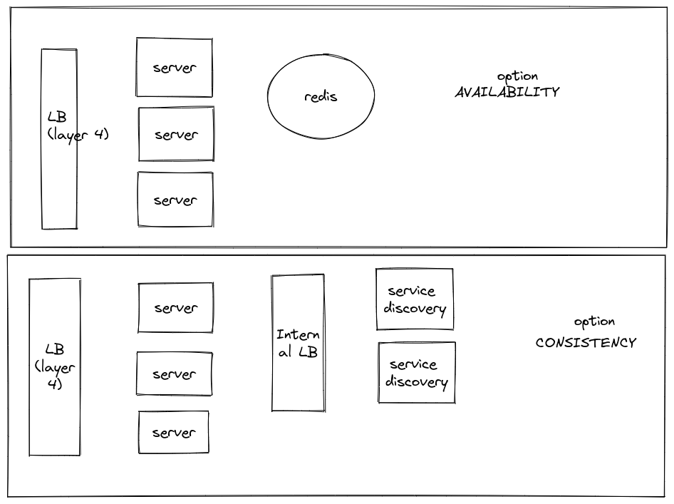

# Blockchain TCP Server (System design)

When designing a high available solution with distributed systems we have to acknowledge the fact 
that partition tolerance is something that we should face so we can only either achieve Consistency or Availability.

We should clarify from product / engineering team whether we need consistency (usually financial systems) or availability (non so critical data).

Below image scenifies potential solutions for both options A or C covering also the cases where a server might crash.

### Option A (availability)

This options returns always a value though not necessarily the most up-to-date data.

Servers publish to Redis whenever a connection is established and when a connection is disconnected.

The data sent is {serverId: numConnections} and the key sent is set to expired in e.g. 5 seconds

Additionally, a heartbeat is sent from the servers every 5 seconds with the sane information e.g. {serverId: numConnections}

When we need to return the num connections we simply fetch the keys from Redis and add all the entries

This, potentially, has stale data. e.g. if a server has crashed but the data is still present in Redis

Server should be deployed in different Availability Zones for better availability. 

We could use Redis Enterprise that ensures five-nives of high availability

AWS Load balancer is high available as well.

### Option B (consistency)

In this option we have a service discovery that broadcasts to all servers asking how many users they have connected

The information is aggregated in the service discovery and returned to the server where the petition originated

In option B, server connects to the internal load balancer that has configured 2 instances of the service discovery as backend pool, hence providing high availability.

**DISCLAIMER:** True consistency will never be achieved since the data can be stale at any moment i.e. new connections keep happening while the getUsersConnected operation is going on

Regarding the WHERE command and being globally unique identifier, UUID is already unique and the possibility of collision is practically null.

If that is not enough, we could explore to have a service providing such functionality such as Twitter snowflake

### Observability

We need to ensure and measure 99.95% SLO availability. We could use prometheus to scrape the health endpoint from the loadbalancer. 

This health endpoint will comprehend different probes to all backend pool instances (servers and service discovery) 

We should also try to keep connections short-lived as this will have an impact in the load balancer routing

Additionally to the health endpoint, we should have dashboards covering latency, availability, errors and traffic to better assess the health of the system.

Furthermore, we need to set alerts based on agreed thresholds that would prompt us to anticipate to failures in the system

### Questions to the product/engineering team

- Is it ok that global unique ID is bound to the instance? A restart of the server currently provides a different ID
- Do we want our solution to be strong consistent or high available? What is the eviction time acceptable in case of A?
- How long do we want to keep the connections opened?
- What is an accepted SLO? latency, errors, availability, saturation, aggregation of some?
- How many concurrent users are to be expected?

